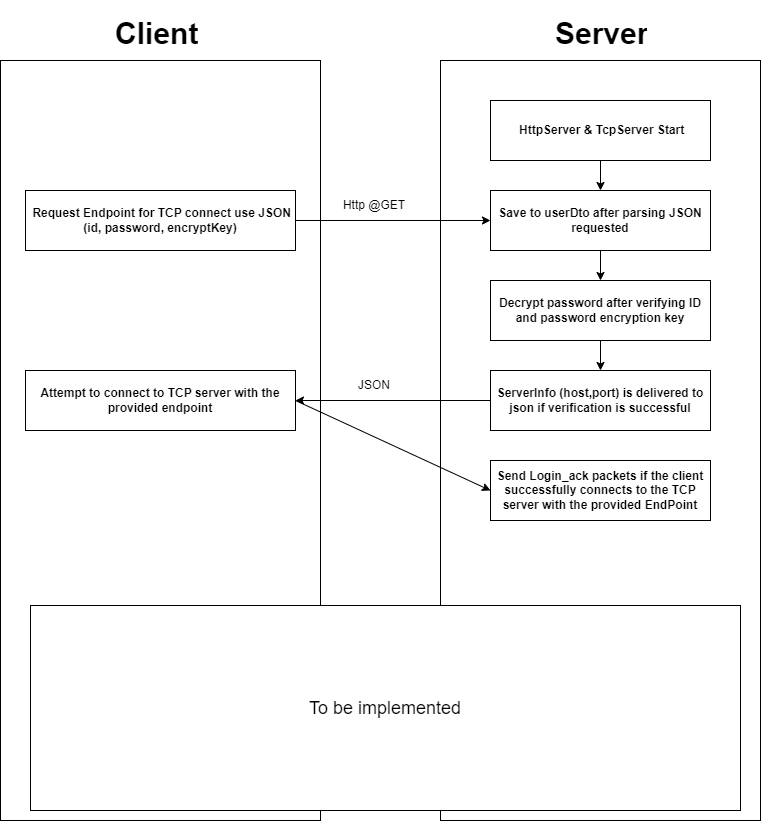

# Project information

## Requirements
- MVC Structure
- use TCP, DB(MYBATIS) ORM
- DB
    - MESSAGE INTERFACE
    - IMPL TEST
    - TCP Definition
    - use JSON
    - Create SEND, SEND_ACK, REPORT, REPORT_ACK
- MESSAGE QUEUE INTERFACE
    - Try a Managed Messaging Protocol
    - interface.(SEND, json);

## FlowChart


## COMMIT

| DATE         | content |
|--------------|--|
| [2022-10-05] | Httpserver 생성, password 디코딩 비즈니스 로직 추가, 각 목적별 Dto 생성, Exception으로 오류 처리 , Http 요청에 따른 Request 구현, Object Mapper 로직 추가, Httpserver 테스트 코드 작성, handler작성 중|                                                                                                        |

## Used Library
```c
  implementation 'org.projectlombok:lombok:1.18.22'

    implementation group: 'org.apache.commons', name: 'commons-configuration2', version: '2.0'
    implementation group: 'org.bouncycastle', name: 'bcprov-jdk15on', version: '1.68'
    implementation group: 'commons-beanutils', name: 'commons-beanutils', version: '1.9.3'

    // TEST IMPLEMENTS
    testImplementation 'org.assertj:assertj-core:3.23.1'
    testImplementation "org.junit.jupiter:junit-jupiter:5.8.1"
    testImplementation 'org.junit.jupiter:junit-jupiter-api:5.8.2'
    testRuntimeOnly 'org.junit.jupiter:junit-jupiter-engine:5.8.2'
    testImplementation "org.testcontainers:testcontainers:1.17.3"
    testImplementation "org.testcontainers:junit-jupiter:1.17.3"
    testImplementation "org.testcontainers:postgresql:1.17.3"

    // UTILS
    implementation 'org.projectlombok:lombok:1.18.24'
    compileOnly 'org.projectlombok:lombok:1.18.24'
    annotationProcessor 'org.projectlombok:lombok:1.18.24'
    implementation group: 'com.google.guava', name: 'guava', version: '31.1-jre'
    implementation group: 'com.fasterxml.jackson.core', name: 'jackson-databind', version: '2.13.4'

    // log
    implementation 'org.slf4j:slf4j-api:1.7.36'
    implementation 'ch.qos.logback:logback-classic:1.2.11'
    implementation 'ch.qos.logback:logback-core:1.2.11'
    implementation 'ch.qos.logback:logback-access:1.2.11'

    // HTTP
    implementation group: 'org.apache.httpcomponents.client5', name: 'httpclient5', version: '5.1.3'

    // DBCP2
    implementation group: 'org.apache.commons', name: 'commons-dbcp2', version: '2.9.0'

    // JDBC DRIVER
    implementation 'org.postgresql:postgresql:42.5.0'

    //JWT
    implementation group: 'io.jsonwebtoken', name: 'jjwt-api', version: '0.11.5'
````
## Project Structure

```bash

└─src
    ├─main
    │  ├─java
    │  │  └─kr
    │  │      └─nanoit
    │  │          ├─common
    │  │          │      HandlerUtil.java
    │  │          │      Validation.java
    │  │          │
    │  │          ├─config
    │  │          │      Base64Coder.java
    │  │          │      Crypt.java
    │  │          │      Verification.java
    │  │          │
    │  │          ├─controller
    │  │          ├─dto
    │  │          │      HttpBadResponseDto.java
    │  │          │      ServerInfo.java
    │  │          │      UserDto.java
    │  │          │
    │  │          ├─exception
    │  │          │      HttpException.java
    │  │          │
    │  │          ├─http
    │  │          │      HealthHandler.java
    │  │          │      HttpServerHandler.java
    │  │          │      SandBoxHttpServer.java
    │  │          │
    │  │          ├─main
    │  │          │      Main.java
    │  │          │
    │  │          ├─model
    │  │          └─util
    │  │                  GlobalVariable.java
    │  │                  Mapper.java
    │  │
    │  └─resources
    │          test.properties
    │
    └─test
        ├─java
        │  └─kr
        │      └─nanoit
        │          └─http
        │                  HttpServerHandlerTest.java
        │                  SandBoxHttpServerTest.java
        │
        └─resources

```
